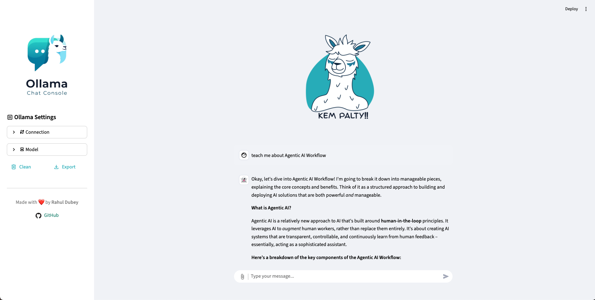

# OCC - Ollama Chat Client

<div align="center">
    
    <br/>
    <p>A simple and elegant chat client for local Large Language Models (LLMs) powered by Ollama.</p>
</div>

---

## 🚀 Features

* **Local LLM Interface:** Connects directly to a local Ollama server, ensuring your conversations stay private on your machine.
* **Customizable Models:** Easily switch between different models available on your Ollama server.
* **Adjustable Parameters:** Fine-tune the LLM's behavior with controls for temperature and max tokens.
* **Streaming & Non-Streaming:** Choose between real-time, streamed responses and a complete response at once.
* **Chat History Management:** Export your conversations to a JSON file or clear them with a single click.
* **File Uploads:** Send images and other files as part of your conversation (supported by multimodal models).
* **Quick Prompts:** Use a variety of pre-defined templates to quickly get started with common tasks like summarizing, debugging, or generating code.
* **Regenerate Responses:** Easily regenerate the last response if you're not satisfied with the output.
* **Responsive UI:** A clean and intuitive user interface built with Streamlit.

---

## 🛠️ Requirements

* **Python 3.x**
* **Ollama:** You must have the Ollama server running on your machine. You can download it from [ollama.ai](https://ollama.ai/).
* **Streamlit:** This is the web framework used to build the application.

---

## ⚙️ Installation & Usage

1.  **Clone the repository:**
    ```bash
    git clone https://github.com/d-evil0per/ollama-chat-console.git
    cd ollama-chat-console
    ```
    (Note: Replace with your actual repository details)

2.  **Install the required Python libraries:**
    ```bash
    pip install streamlit
    ```
    (Note: The code also imports `OllamaClient`, which suggests you may have a custom file. Ensure `OllamaClient.py` is in the same directory and contains the necessary logic for interacting with the Ollama API.)

3.  **Run the application:**
    ```bash
    streamlit run app.py
    ```
    (Note: Replace `app.py` with the name of the Python file containing the provided code.)

4.  **Connect to Ollama:**
    * Ensure your Ollama server is running.
    * The app will attempt to connect to `http://localhost:11434` by default. You can change this URL in the sidebar settings.

---

## 🖼️ Screenshots




---

## 🤝 Contributing

Contributions are welcome! Please feel free to open an issue or submit a pull request.

---

## 📜 License

This project is open-source and available under the MIT License.

---

## 👨‍💻 Author

**Rahul Dubey**

* **GitHub:** [d-evil0per](https://github.com/d-evil0per)